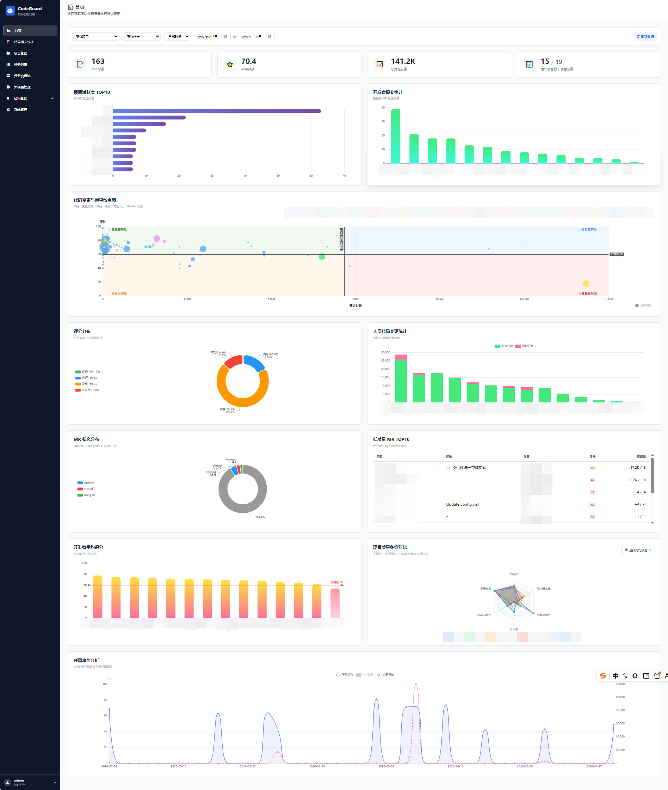
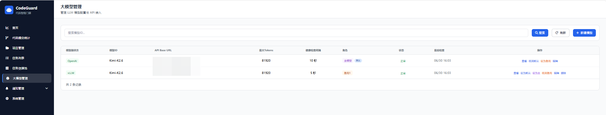
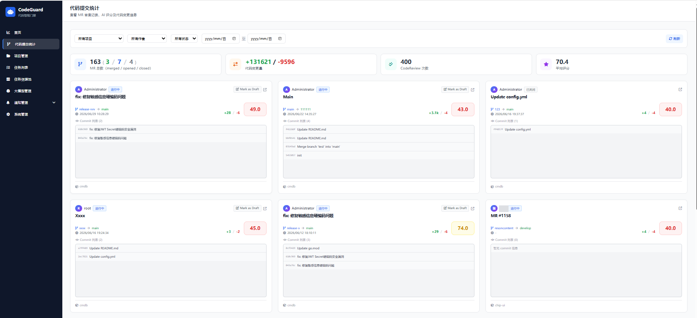
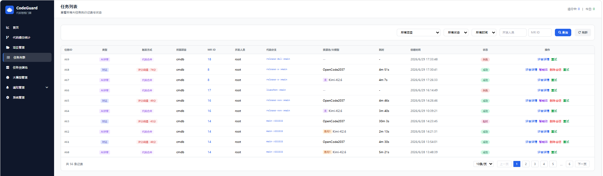
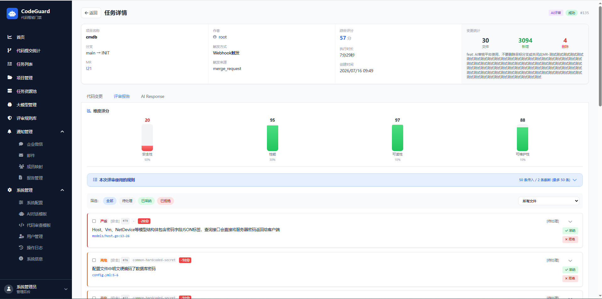
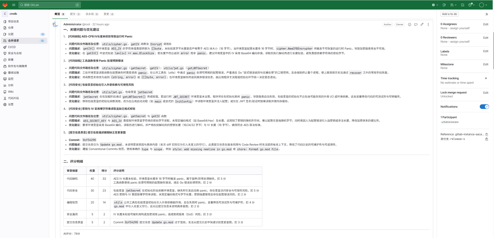
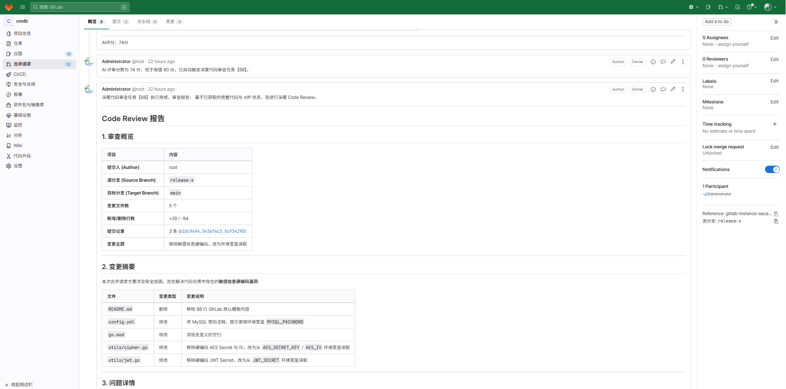

<div align="center">

# 🤖 CodeGuard / AI CodeGuard

**AI 驱动的智能代码审查门禁系统**
<br>
<em>AI-Powered Code Review Gate System</em>

[](https://go.dev)
[](https://gin-gonic.com)
[](https://tailwindcss.com)
[](https://mysql.com)
[](https://docker.com)

</div>

---

## 📖 项目简介 / Overview

**CodeGuard**（又称 **AI CodeGuard**）是一款面向企业级 GitLab 工作流的 AI 智能代码审查平台。系统通过 GitLab Webhook 自动触发 AI 代码审查，基于多 LLM 模型进行多维度评分（0-100 分），并根据阈值策略自动触发深度代码审查，帮助团队在生产代码合入前拦截潜在风险。

> CodeGuard is an enterprise-grade AI-powered code review platform designed for GitLab workflows. It automatically triggers AI code review via GitLab Webhooks, performs multi-dimensional scoring (0-100) using multiple LLM models, and auto-invokes deep review based on configurable thresholds to intercept risks before merging.

---

## ✨ 核心特性 / Features

| 特性 | Feature | 说明 |
|------|---------|------|
| 🔗 | **GitLab Webhook 集成** | Merge Request 自动触发 AI 评审；支持 Note 评论触发交互式审查 |
| 🤖 | **AI 评分系统** | 0-100 分智能评分，低于阈值自动触发深度代码审查 |
| 🧠 | **多 LLM 模型管理** | 支持配置多个模型提供商，支持主模型/备用模型角色切换与自动故障切换 |
| 🏊 | **OpenCode 资源池** | OpenCode 服务资源池的统一接入、调度与健康监控 |
| 📊 | **Dashboard 统计看板** | KPI 总览、雷达图、趋势分析、任务分布统计 |
| 📈 | **MR 审查日志** | 独立的 MR 聚合统计与审查记录，支持项目/作者筛选 |
| 💬 | **实时 AI 对话** | 基于 SSE 的流式事件，任务执行过程可实时与 AI 交互 |
| 📧 | **邮件报告系统** | 周报/月报自动生成，Outlook 兼容 HTML 邮件模板，支持分组发送 |
| 🔔 | **企业微信通知** | WeCom 群机器人实时推送审查结果 |
| 👤 | **成员映射** | Git 用户名与企业微信 IM 用户的自动映射 |
| 🔐 | **完整认证体系** | bcrypt 密码加密 + JWT Token 鉴权 + GitLab OAuth 登录 + 操作日志审计 |
| ⚙️ | **系统配置化** | 全量系统参数 Web 端可配置（超时、阈值、通知等），无需重启服务 |
| 📈 | **资源池/模型监控告警** | 异常持续达阈值后自动发企业微信告警，恢复后发送恢复通知 |
| 🔄 | **MR 状态同步** | 定时轮询 GitLab，刷新本地 opened MR 的合并/关闭状态 |
| 🛡️ | **Diff 截断保护** | 超阈值大代码块入库前自动截断，防止 DB 存储爆炸 |
| 🏷️ | **任务模型追踪** | Review 任务记录实际使用的 LLM 模型，列表展示 `[主]/[备用N] model_id` |
| 🔁 | **人工复核与重试** | 支持对 AI 评审结果人工复核，选择历史意见注入后重新评审 |
| 📝 | **项目模板管理** | 支持为不同项目配置差异化 AI 评审提示词模板 |
| 🔍 | **结构化 Issue 评审** | 按规则拆分代码审查结果，支持逐条/批量采纳与拒绝，拒绝需填写原因 |
| 📋 | **评审规则库** | 内置通用/Go/Python/前端/Java 多语言规则库，项目级启用/禁用与严重程度覆盖 |
| 📊 | **规则命中统计** | 独立的规则命中率、修复率、误报率统计页面；支持规则钻取、最近命中分页与代码片段查看 |
| 💰 | **Token 用量监控** | 全量 LLM 调用 token 用量记录（输入/输出/缓存/成本），按模型/项目/作者/任务维度聚合分析 |
| 🔁 | **LLM HTTP 重试** | 502/503/504 + 网络层瞬时错误自动指数退避重试；最大次数/初始延迟/退避倍率/最大延迟全部可配置 |


---

## 🖼️ 产品截图 / Screenshots

### 首页统计 Dashboard



### 大模型管理



### MR 代码提交统计



### 任务管理



### 任务详情



### AI评审（MR评论）



### AI深度评审（MR评论）



---

## 🏗️ 技术架构 / Architecture

```text
+-------------------------------------------------------------------+
|                          Client Browser                             |
|               (Vanilla HTML + TailwindCSS Frontend)                |
+-------------------------------+-----------------------------------+
                                 |  HTTP / API
+-------------------------------v-----------------------------------+
|                        Gin HTTP Server                              |
|   Static File Serving (prototype/)                                   |
|   JWT Auth Middleware                                               |
|   CORS / Logger / Recovery                                          |
+---------------+---------------+---------------+-------------------+
                 |               |               |
      +----------v----+  +------v------+  +------v------+
      |   Webhook     |  |  Dashboard  |  |   Report    |
      |   Handler     |  |   Handler   |  |   Handler   |
      +-------+-------+  +------+------+  +------+------+
              |                |               |
+------------v----------------v---------------v---------------------+
|                         Service Layer                               |
|   ProjectService  TaskService  PoolService  ModelService           |
|   ReportService  NotifierService  MemberMappingService             |
|   LLMService  UserService  MRReviewLogService                       |
+------------+--------------+--------------+--------------+---------+
             |              |              |              |
   +---------v------+ +----v------+ +----v------+ +----v----------+
   |    GORM ORM     | |   Cron    | |  GitLab   | |  SMTP /      |
   |  (MySQL)        | | Scheduler | |  API      | |  WeCom       |
   |                 | |           | |  Client   | |  Webhook     |
   +-----------------+ +-----------+ +-----------+ +--------------+
           |                                              |
   +-------v-------+                            +--------v---------+
   |  codeguard    |                            | External Services|
   |   (Main DB)   |                            | - OpenCode Pool  |
   +---------------+                            | - LLM APIs       |
                                                | - GitLab CE/EE   |
                                                | - WeCom Bot      |
                                                | - Mail Server    |
                                                +------------------+
```

### 任务执行流程

```
GitLab MR Webhook
       |
       v
[Create Review Task] --(pending)--> [ExecuteAIReviewTask]
       |                                   |
       |                                   v
       |                         [Multi-LLM Score Review]
       |                                   |
       |                                   v
       |                    score >= threshold ? [Success]
       |                                   |
       |                        score < threshold
       |                                   |
       |                                   v
       |                    [Trigger Deep Review Task]
       |                                   |
       |                                   v
       |                         [ExecuteWithComment]
       |                                   |
       |                                   v
       |                          [OpenCode Agent]
       |                                   |
       v                                   v
[MR Comment with Result]     [MR Comment with Report]
```

---

## 🚀 快速开始 / Quick Start

### 1. Clone 项目

```bash
git clone <your-repo-url> AI-Code-Review
cd AI-Code-Review
```

### 2. 配置环境变量

```bash
cat > .env <<EOF
DB_HOST=your_mysql_host
DB_NAME=your_mysql_db_name
DB_PASSWORD=your_mysql_password
ENCRYPTION_KEY=your_32_byte_encryption_key_here!!
EOF
```

> ⚠️ `ENCRYPTION_KEY` 必须为 **32 字节**，用于敏感数据 AES 加密存储，可以不用配置。

### 3. 启动服务

```bash
docker run -d -p 8080:8080 \
  --env-file .env \
  docker.m.daocloud.io/securityneo/ai-code-review:latest
```

- 构建并启动 AI-Code-Review 服务（请先构建好容器镜像）

### 4. 访问系统

| 端点 | 说明 |
|------|------|
| `http://localhost:8080` | 统计看板（默认首页） |
| `http://localhost:8080/login.html` | 登录页面 |
| `http://localhost:8080/api/v1/webhooks/gitlab` | GitLab Webhook 接收地址 |

默认管理员账号：`admin / admin123`（首次登录后请立即修改密码）

---

## ⚙️ 环境变量 / Environment Variables

### 必填项 / Required

| 变量 | 示例 | 说明 |
|------|------|------|
| `DB_PASSWORD` | `change_me` | 数据库密码 |
| `ENCRYPTION_KEY` | `your_32_byte_key_here!!` | AES 加密密钥，必须为 32 字节 |

### 数据库 / Database

| 变量 | 默认值 | 说明 |
|------|--------|------|
| `DB_HOST` | `127.0.0.1` | 数据库主机 |
| `DB_PORT` | `3306` | 数据库端口 |
| `DB_USER` | `root` | 数据库用户 |
| `DB_NAME` | `ai_optimizer` | 业务数据库名 |
| `DATABASE` | `mysql` | 数据库类型：`mysql` / `postgres` |
| `DSN` | `""` | 完整 DSN（配置此项可跳过上述拆分配置） |

### GitLab & 业务配置

| 变量 | 默认值 | 说明 |
|------|--------|------|
| `GITLAB_TOKEN` | `""` | GitLab API Token，当项目未单独配置 AccessToken 时作为全局 fallback 用于请求 GitLab API |
| `PROJECT_BASE_DIR` | `/data/gitlab/` | 项目代码克隆存储目录 |

### 任务与系统

| 变量 | 默认值 | 说明 |
|------|--------|------|
| `TASK_TIMEOUT_MIN` | `30` | 单个任务超时时间（分钟） |
| `MAX_PARALLEL_TASK` | `20` | 系统最大并行任务数 |

### 应用通用

| 变量 | 默认值 | 说明 |
|------|--------|------|
| `PORT` | `8080` | HTTP 服务端口 |
| `DEBUG` | `false` | 调试模式（开启后输出 Debug 级别日志） |
| `FRONTEND_PATH` | `/app/prototype` | 前端静态文件目录（Docker 镜像内路径） |

> 生产环境请务必设置 `ENCRYPTION_KEY` 和 `DB_PASSWORD`。

---

## 🛠️ 开发环境 / Development Setup

### 前置依赖

- Go 1.26+
- MySQL 8.0（或 PostgreSQL）
- Node.js（可选，仅用于 TailwindCSS CLI 构建前端）

### 本地运行步骤

```bash
# 1. 进入后端目录
cd backend

# 2. 安装依赖
go mod download

# 3. 复制环境变量模板
cp .env.example .env
# 编辑 .env 配置你的数据库连接

# 4. 启动服务
go run ./cmd/main.go
```

服务启动后访问：`http://localhost:8080`

### 前端开发

前端采用 Vanilla HTML + TailwindCSS CDN，无需构建步骤。直接修改 `prototype/` 下的 `.html` 文件即可生效。刷新页面即可看到变更。

---

## 🔌 API 接口概览

### 公开接口（无需认证）

| 方法 | 路径 | 说明 |
|------|------|------|
| POST | `/api/v1/login` | 用户登录 |
| POST | `/api/v1/logout` | 用户登出 |
| GET  | `/api/v1/auth/gitlab` | GitLab OAuth 授权跳转 |
| GET  | `/api/v1/auth/gitlab/callback` | GitLab OAuth 回调 |
| POST | `/api/v1/webhooks/gitlab` | GitLab Webhook 统一入口 |
| POST | `/api/v1/tasks/callback` | 任务回调 |
| GET  | `/health` | 健康检查 |


---

## 📦 Docker 镜像构建

### Docker 镜像构建

```bash
docker build -t codeguard:latest .
```

一键构建脚本：

```bash
./scripts/build-docker.sh 1.2.0 latest
```

---

## 🔒 安全说明 / Security

| 项目 | 实现 |
|------|------|
| 密码存储 | bcrypt 哈希 |
| 敏感配置 | AES-256-GCM 加密存储（数据库中密文保存） |
| 接口鉴权 | JWT Bearer Token（含有效期） |
| Webhook 校验 | GitLab Secret Token 校验 |
| GitLab OAuth | 支持 OAuth2 登录，自动创建/绑定用户；OAuth callback token 跨 301 重定向保留 |
| 操作审计 | 全量操作日志记录（请求 IP、操作人、结果） |
| 数据过滤 | 普通用户只能查看自己的任务和 MR 记录 |
| LLM 调用记录 | 完整记录每次 LLM 调用的 prompt/completion/cached tokens、耗时、错误信息，便于审计与成本核算 |

---

## 📄 License

MIT License © 2026 Li Hu, UNICLOUD

---

## 注意

纯AI Coding项目

---

<div align="center">

**AI CodeGuard** — 让每一次代码合并都更安全 🛡️

<em>Make every code merge safer with AI.</em>

</div>
